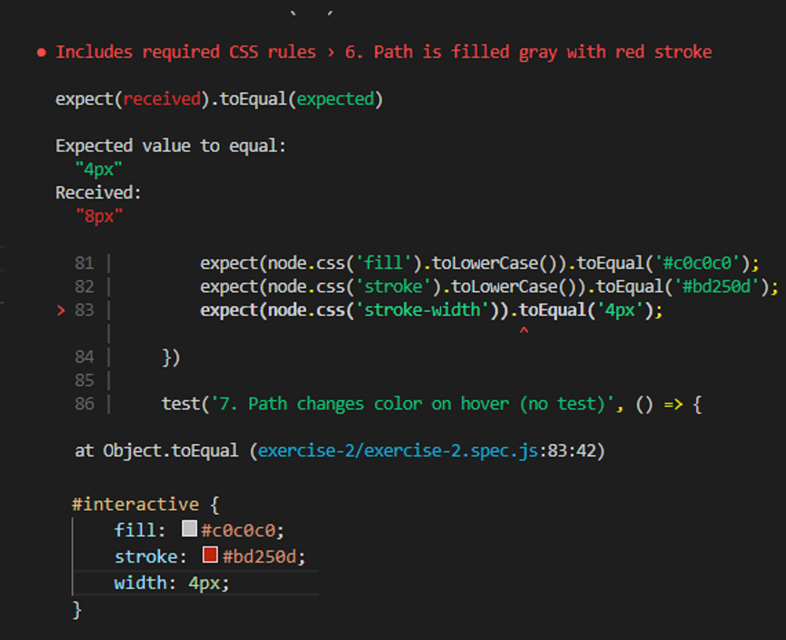

import Box from 'superbox'
import {Appear} from 'mdx-deck'
export { default as theme } from '../theme'
import {Split} from 'mdx-deck/layouts'


# Lab 2
--------
## Debugging, Questions, and CSS

---

# Events

* Consulting 101 workshop tonight 5:30 to 8pm
* Behavioral interview workshop tomorrow
* Business career fair and startup career fair tomorrow
* ProQuest iLounge hangout on wednesday

---

# Questions?

---

<Box
    css={{textAlign: 'left', width: '90vw'}}>
    <div style={{fontSize: 90, fontWeight: 'bold'}}>Debugging</div>
    <hr />
    <ul style={{fontSize: 40}}>
        <Appear>
        <li>Read the error messages carefully!</li>
        <ul><li>Jest tests give you line numbers and specific feedback</li></ul>
        <li>For every possible cause of incorrect behavior, study the code for it! Use print lines! (Applicable after JavaScript)</li>
        <li>Consult documentation</li>
        <li>Read the #announcements channel</li>
        <li>Use stackoverflow (everyone does!)</li>
        <li>Ask peers in #general, Mike, or me! We're here to help!</li>
        </Appear>
    </ul>
</Box>

---



---

## Ask questions in Slack

-----
<Box css={{textAlign: 'left', width: '90vw'}}>
While we're good at it, we can't always guess what exact problems you're facing. We follow standard debugging practices too, and we're going to need to know some things before we can help!

<ul>
    <Appear>
    <li>Context</li>
<li>Relevant error messages</li>
<li>Code snippets <code style={{backgroundColor: 'rgb(39,40,34)', padding: '0.2em', borderRadius: '0.3em'}}>```</code></li>
<div>Slack is difficult to debug over, even with all of these! Be as clear and narrowly scoped in your questions as possible to quickly get the best answers!</div>

</Appear>
</ul>

</Box>

````
```
<html>
</html>
```
````

```notes
<li>Context</li>
<li>Relevant error messages</li>
<li>Code snippets</li>
<div>Slack is difficult to debug over, even with all of these! Be as clear and narrowly scoped in your questions as possible to quickly get the best answers!</div>

```

---

# Useful CSS Library

## FontAwesome Demo
## Look at files [here](https://github.com/info340d-au18/labsections)

---

# Custom Fonts

## Google Fonts Demo
## Look at files [here](https://github.com/info340d-au18/labsections)

```notes
@font-face {
    font-family: "CharmomanTEST";
    src: url(Charmonman-Regular.ttf) format("truetype");
}
```

---

# Flexbox froggy (just for fun)

[https://flexboxfroggy.com/](https://flexboxfroggy.com/)


---
export default Split


```css
.overall {
    display: flex;
    flex-direction: column-reverse;
}

.letter {
    color: black;
    background-color: white;
    width: 100px;
    height: 100px;
    margin: auto;
    margin-top: 10px;
    line-height: 100px;
}
```

<Box>
    <div style={{display: 'flex', flexDirection: 'column-reverse'}}>
        {[...'work'].map(d => {
            return <div style={{
                color: 'black',
                backgroundColor: 'white',
                width: 100,
                height: 100,
                margin: 'auto',
                marginTop: 10,
                borderRadius: 20,
                lineHeight: '100px'
            }} key={d}>{d}</div>
        })}
    </div>
</Box>